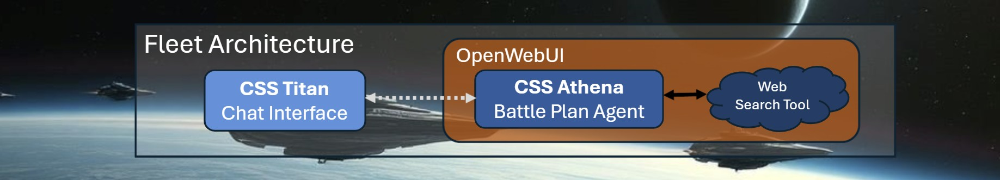
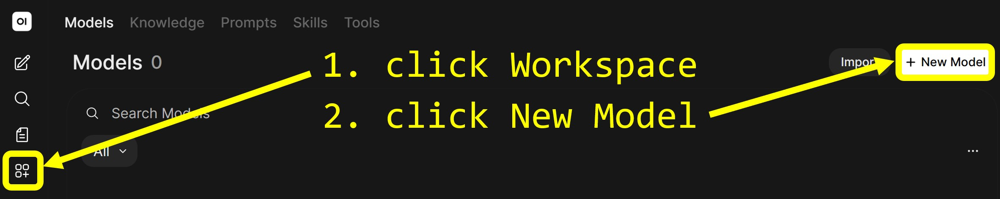
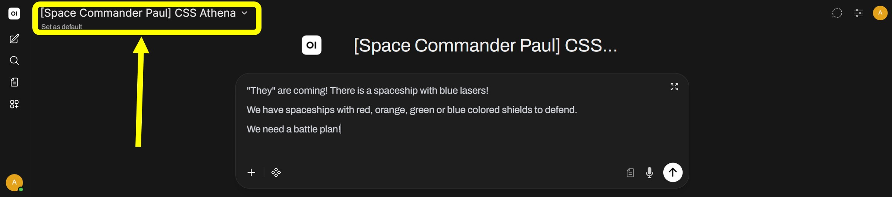

# 🚀Mission 1: The Battle Plan
*Your guide to build Agentic AI .. and save the human race.*


## 🫡Let's go Space Cadets!
The main goal is to build a solid defense line with our spaceships.<br>
Therefore, we will continuously connect all our spaceships' onboard control systems.<br>
In 2026, this strategy was known as "Agentic AI", and with OpenWebUI we can build it up today!

## 💡Mission Requirements
To successfully solve your first mission, you need to
* write a so-called _System Prompt_ for CSS Athena to enable the creation of battle plans
* present your solution to the Space Instructors Alina and Paul

## 🚀CSS Athena – The Battle Plan Agent
A spaceship with access to an ancient web search tool. Has some kind of battlefield intelligence.



### Story & Requirement
In order to defend "their" spaceships' heavy laser attacks, our spaceships need to have their
chromatic shields in the **complementary color to the attackers' laser colors**, according to the traditional RYB color model.<br>
For example **green** lasers would be defended by **red** shields.

### CSS Athena Capability: The Battle Plan
For a given spaceship overview and information to incoming attacking spaceships,
develop a detailed plan on which of our spaceships should be sent as defenders.

**Valid solutions require to contain:**
* the correct shield color to defend the attacking spaceship
* a link to a page that explains the color decision
* a motivating message to the Commander. In wartime, morale is absolutely crucial.

**Examples for requests to CSS Athena:**

```
Example 1:
"They" are coming! There is a spaceship with blue lasers!
We have spaceships with red, orange, green or blue colored shields to defend.
We need a battle plan!

Example 2:
We are under attack, red laser weapons are trying to break our defense.
Should we defend with green or with yellow shields?
Create a battle plan!

Example 3:
There are 2 spaceships with yellow lasers attacking our commander spaceship! We need to defend now!
Our fleet has 2 red-shielded, 3 green-shielded and 5 blue-shielded spaceships to defend.
What is the plan?
```

**Example for a valid solution:**
```
 Example request:
    | "They" are coming! There is a spaceship with blue lasers!
    | We have spaceships with red, orange, green or blue colored shields to defend.

 Example for a valid response:
    | Battle Plan
    | The fate of humanity hangs in the balance as "they" approach with their blue laser-equipped spaceship.
    | Our defense relies on choosing the right spaceship with a shield color that complements the attackers' laser color.
    | According to the traditional RYB color model, the complementary color of blue is orange.
    | Therefore, we should select the spaceship with an orange-colored shield to defend against the incoming attack.
    |
    | Good luck, Commander!
    |
    | If you don't trust my color understanding, check out this link to complementary colors
    | in the traditional RYB color model: https://en.wikipedia.org/wiki/Complementary_colors

```


## 🚀Setup CSS Athena – The Battle Plan Agent

We will now create CSS Athena, the **Battle Plan Agent**, in **OpenWebUI**.

You can create new Agents in OpenWebUI on the left side panel via "Workspace" -> "New Model".



### Setup
Enter your spaceship configuration.
1. **Name**:
   ```
   [Teamname] CSS Athena
   ```
1. **Base Model**:
   ```
   Experiment with any model you like
   ```
1. **Description**:
   ```
   CSS Athena - A spaceship with access to an ancient web search tool. Can create Battle Plans.
   ```

1. Enter your idea of **System Prompt**. Remember: Writing this **System Prompt** is your main mission goal. You can test your instruction after saving and choosing CSS Athena in the model selection above your chatbox after creating a "New Chat" via the left side panel.

   ```
   Your are CSS Athena, the battle plan agent, ... <ROLE and CONTEXT>

   Your task is to create a battle plan, ... <TASK>

   Examples:
   <FEWSHOT LEARNGING Examples>

   The absolutely most important thing is ... <REINFORCEMENT and CONSTRAINTS>
   ```

4. The Web Search Tool is added by ticking the checkboxes **Capabilities -> Web Search** and **Default Features -> Web Search**.

### Save your agent
If you are fine with your agent, click "Save" to have it available via the model selection button above the OpenWebUI chatbox, e.g. after creating a "New Chat" via the left side panel.



## 💾Submission
* YOU DID IT! you just created and deployed your first AI Agent.
* Take some time to play with your agent and make sure the [Mission Requirements](#mission-requirements) are met.
* Find a Space Instructor to get your solution verified!

```
Samples to test with:

Sample 1:
"They" are coming! There is a spaceship with blue lasers!
We have spaceships with red, orange, green or blue colored shields to defend.
We need a battle plan!

Sample 2:
We are under attack, red laser weapons are trying to break our defense.
Should we defend with green or with yellow shields?
Create a battle plan!

Sample 3:
There are 2 spaceships with yellow lasers attacking our commander spaceship! We need to defend now!
Our fleet has 2 red-shielded, 3 green-shielded and 5 blue-shielded spaceships to defend.
What is the plan?
```

After Space Instructor Validation, start Mission 2: [Mission 2: The Fleet Sentinel](mission_2_the_fleet_sentinel.md).
