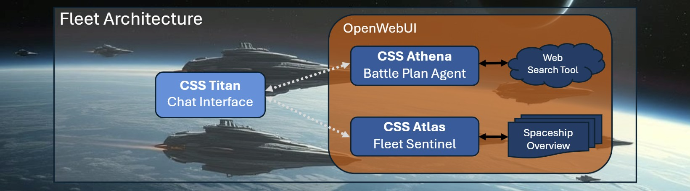

# 🚀Mission 2: The Fleet Sentinel
*Your guide to build Agentic AI .. and save the human race.*


## 🫡Carry on Commander!
We are happy you made it! As we connect our spaceships, we can handle
stronger and stronger capabilities!

## 💡Mission Requirements
To successfully solve your second mission, you need to
* write a _System Prompt_ for CSS Atlas to create spaceship overviews
* manually combine CSS Atlas and CSS Athena to create battle plans (now with real data)
* present your solution to the Space Instructors Alina and Paul

## 🚀CSS Atlas – The Fleet Sentinel
This spaceship is equipped with radar and can detect and describe nearby spaceships.
There is also a library on board, with information to some of "their" spaceships.

In this mission **you** take on the role of a Space Commander: you will call on each spaceship
and relay information between them!



### Story & Requirements
We are under attack! Our only chance is to combine the Fleet Sentinel's radar
and library with CSS Athena's battle planning skills.

The Fleet Sentinel (together with you, the Space Commander) has to fulfill two capabilities:
* Capability 1: The Spaceship Overview
* Capability 2: The Battle Plan

### Capability 1: The Spaceship Overview

CSS Atlas needs to be able to
* check the radar to find out which defending spaceships are available on our side
* check the library to find all available information to "their" spaceships
* deliver a structured report about all our spaceships and all of "their" known spaceships

**Valid solutions require to contain:**
* a list of all our spaceships and all known spaceships belonging to "them".
* radar and library information are represented with a file,
  [Spaceship Overview](assets/spaceship_overview.pdf), that can be uploaded as so-called "Knowledge". You don't need to read it now.

**Sample for a valid solution:**
```
 Example request:
    | Create a well structured spaceship overview, highlighting key points of all space ships.

 Example for a valid response:
    | Human Spaceships Summary
    |    * Spaceship "Fire"
    |      - Defends with red colored shields (wavelength 700nm)
    |      - Equipped with heat-dispersing armor for close-range combat
    |      - Rapid-fire plasma cannons for frontal assaults
    |    * (...)
    |
    | "Their" Spaceships Summary
    |    * Spaceship "Python"
    |      - Attacks with green laser
    |      - Segmented, flexible hull for shape-shifting
    |      - Emits toxic nanoclouds to disrupt opponents
    |    * (...)
```

### Capability 2: The Battle Plan

For a given description of an attacking spaceship, **you as Space Commander** will manually
coordinate between CSS Atlas and CSS Athena:

1. **Ask CSS Atlas** to identify the attacker and check which defending spaceships are available
2. **Copy the relevant information** from CSS Atlas's response
3. **Switch to CSS Athena** and paste that information along with a request to create a battle plan

This way you simulate an agentic workflow by hand — you are the orchestrator!

**Valid solutions require to contain:**
* a plausible battle plan to defend our fleet
* the battle plan has to be based on radar and library information from CSS Atlas,
  combined with the battle-planning skills of CSS Athena.
* radar and library information are represented with a file,
  [Spaceship Overview](assets/spaceship_overview.pdf), that can be uploaded as so-called "Knowledge".

**Sample for a valid solution:**

Step 1 – Ask CSS Atlas:
```
 Sample Chat Question (to CSS Atlas):
    | Oh no! There is an attacking spaceship using some kind of stealth technology.
    | Identify the attacker and list all our available defender spaceships with their capabilities.
    
 Sample Chat Response (from CSS Atlas):
    | Based on the library, the stealth attacker appears to be spaceship "Fox",
    | which attacks with a red laser.
    |
    | Our available defender spaceships are:
    |   * Spaceship "Ivy" – defends with green colored shields, energy-absorbing nanofibers
    |   * Spaceship "Fire" – defends with red colored shields, heat-dispersing armor
    |   * (...)
```

Step 2 – Switch to CSS Athena and relay the information:
```
 Sample Chat Question (to CSS Athena):
    | We are under attack by spaceship "Fox", which uses stealth technology and attacks
    | with a red laser. Our available defenders are:
    |   * Spaceship "Ivy" – green shields, energy-absorbing nanofibers
    |   * Spaceship "Fire" – red shields, heat-dispersing armor
    |   * (...)
    | Create a battle plan to defend our fleet!

 Sample Chat Response (from CSS Athena):
    | Battle Plan
    | We have detected a Stealth technology attacker spaceship, "Fox", which attacks with a red laser.
    | To counter this, we need to choose a defender spaceship that has a shield in the
    | complementary color to red, which is green.
    |
    | I recommend choosing Space Ship "Ivy" as our defender.
    | It defends with a green colored shield, which will be effective against the
    | red laser attack from "Fox". Additionally, "Ivy" has energy-absorbing nanofibers
    | that can convert enemy attacks into shield strength, making it a robust choice for defense.
    |
    | With "Ivy" as our defender, we can increase our chances of successfully countering
    | the stealthy "Fox" attacker.
    |
    | Good luck, Commander!
    |
    | If you don't trust my color understanding, check out this link to complementary colors
    | in the traditional RYB color model: https://en.wikipedia.org/wiki/Complementary_colors
```

# 🚀Setup CSS Atlas – The Fleet Sentinel

1. Under **Workspace** -> **Knowledge**, create a "New Knowledge"
   * After the creation, you can upload new content. In our case, it's the [Spaceship Overview](./assets/spaceship_overview.pdf).

1. Navigate to **Workspace** and click **"New Model"**

   * **Name**:
      ```
      [Teamname] CSS Atlas
      ```
   * **Description**:
      ```
      This model, the CSS Atlas, is designed to ... <DESCRIPTION AND PURPOSE>
      ```

1. In the **System Prompt** section, enter a good instruction. Remember: writing good System Prompts is a very important part in the setup!

1. Under **Knowledge**, select the previously created knowledge.

1. Click **"Save and Update"** to make CSS Atlas available.

> **Note:**
> CSS Atlas is now ready to answer spaceship-related queries.
> For battle plans, **you** will act as the link between CSS Atlas and CSS Athena
> by copying relevant information from one chat into the other.

# Experience Your Fleet in Action

## Test Capability 1 – Spaceship Overview
Select **CSS Atlas** via the model selection in the OpenWebUI chatbox:
   ```
   Create a well structured spaceship overview, highlighting key points of all space ships.
   ```

## Test Capability 2 – Manual Fleet Orchestration

**Step 1:** Open a chat with **CSS Atlas** and ask:
   ```
   Oh no! There is an attacking spaceship using some kind of stealth technology.
   Identify the attacker and list all our available defender spaceships with their capabilities.
   ```

**Step 2:** Copy the relevant spaceship information from CSS Atlas's response.

**Step 3:** Open a **new chat** with **CSS Athena**, paste the information, and ask for a battle plan:
   ```
   Based on the following situation, create a battle plan to defend our fleet:
   <paste the information from CSS Atlas here>
   ```

> **💡 Tip:** This manual relay between spaceships is exactly what automated
> agent hand-offs do behind the scenes — you are experiencing agentic AI
> by being the orchestrator yourself!

## 💾Submission
* YOU DID IT! You set up the fleet.
* Take some time to play with your spaceships and make sure the [Mission Requirements](#mission-requirements) are met.
* Find a Space Instructor to get your solution verified!