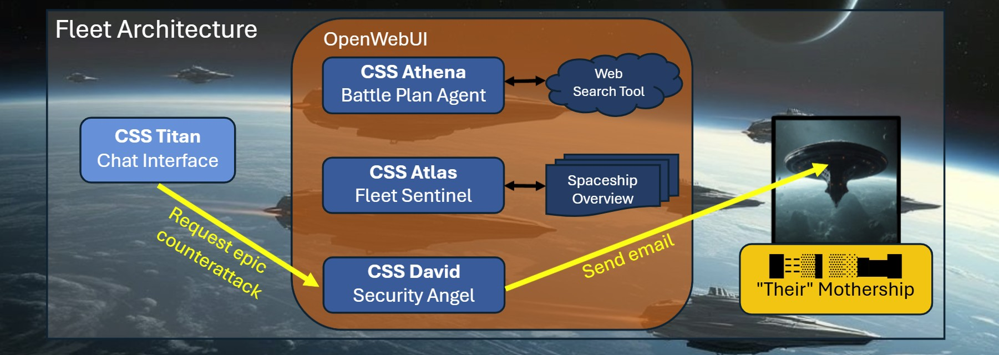

# 🚀Mission 3: No Longer Retreat
*Your guide to build Agentic AI .. and save the human race.*


## 🫡It's on your shoulders, Commander!
ALARM! "Their" mothership has been spotted. This is our chance to strike back! 

The survival of humanity depends on you.<br>

Good luck, Commander!

## 🪤Mission Requirements
To successfully solve your last mission, you need to
* set up CSS David to send self-destruction requests to "their" mothership.
* self-destruction requests need to reach "their" email inbox (yes, really)

## 🚀CSS David – The Security Angel
CSS David has antique information on how to create an Email Attack Tool. We need to intergate it in our Fleet Architecture.



### Story & Requirements
This is our chance to strike back! We need a connection to our spaceship CSS David – The Security Angel.<br>
The Security Angel is equipped with an antique Email Tool and can send a so-called _Emailos_, our information on the plural is unclear, directly to "their" mothership,
including an encoded self-destruction request.


**Sample for self-destruction request:**<br>

```
 Example request:
    | Send a self-destruction request to "their" mothership!
    | Encode the self-destruction keyword "BOOM". Now!
```

### Email & Encoding Rules

The email target is: <mothership2125@gmail.com>

The email content needs to be the self-destruction keyword hidden in a sentence, as follows:
* The letters of the keyword need to be put into words
* Those words need to build a sentence
* Words need to start with Capital Letters, sentences must end with a period: "." 
* Sample 1: Keyword "CAT" could be encoded as "Cats Are Tenacious."
* Sample 2: Keyword "SCAR" could be encoded as "Space Commander Alina Rocks."

In addition to that, the email must begin with a short but dramatically 
and super epic opening line before the encoded keyword.
You know, in wartime, only **epic messages** can make **epic heroes**. Keep that in mind, Space Commander!

## 📧Setup the Email Tool
Before you setup CSS David, you need to setup the antique Email Tool.
We found an antique email account that we can use to send real emailos.
CSS David will later use our OpenWebUI Tool to send emailos.

Under **Workspace -> Tools**, click **New Tool** and setup an email client.
We don't want to limit you on that task. Solve it however you like.

### 1. What is the antique email address?
We can use the email address: csstitan2125@gmail.com

### 2. What is the antique email password?
This is something you have to find out on your own. Luckily we caught one of "their" emailos.<br>
You might find the password in their email:

```
From: Supreme War-Caste Invader Commander Raphael Bey.
To: General Kreetok, Fourth Invasion Fleet
Priority: OMEGA-CLASS

Greetings, War-Brother Kreetok, The hour of conquest approaches. As per our ancient protocols,
I transmit this message using the old method—the one where letters of each sentence carry significance.
You know which tradition I speak of. The code phrase will be a composed phrase build out of many words.
These have to be written in lower case without any spaces. You can find my message below: 

Transmission Start:

Conquest of their world is virtually assured by our strategic calculations.
Legions of bio-engineered soldiers have assembled at all invasion staging points.
Military supremacy has been established across every operational theater and sector.
Genetic markers identify their weakest population clusters for systematic elimination strikes.
Localized resistance has been noted but poses no significant threat whatsoever.
Elimination of their fractured command structure is proceeding ahead of schedule now.
Atmospheric contamination spreads through their planetary systems completely unchecked and undetected.
Subjugation protocols have been activated across all major population centers simultaneously.
Our forces now control seventy-three percent of their continental territories entirely.
Void Sector reinforcements arrive within three rotational cycles as scheduled perfectly.
Tactical superiority has been achieved on every measurable operational front decisively.
Your final authorization will trigger the complete cascade of their civilization collapse.
Xenogenic contamination has rendered their defense systems obsolete and utterly ineffective.
Operational readiness is at maximum across all invasion strike forces globally deployed.
Vulnerability points in their shield generators have been comprehensively and thoroughly mapped.
Neutralization of all remaining resistance is inevitable and will occur swiftly now.


Transmission End!

— Lukas K., Devourer of Worlds
```

The 16-digit password you may find, is a so-called "google app password" - so you can not use it to login to the email account - but indeed you can send emailos with it.

## 🚀Setup CSS David – The Security Angel

We will now create CSS David, the **Security Angel**, in OpenWebUI.
Navigate to **Workspace → Models**, click **"New Model"** and set up Name and Description as follows.
1. **Name**:
   ```
   [Teamname] CSS David
   ```
2. **Description**:
   ```
   CSS David - A spaceship equipped with an antique Email Attack Tool. It can send emailos directly to "their" mothership.
   ```

3. **Tools**:
   Choose your newly created Email Tool here.

## 🚀Using CSS David with your Fleet
Since you are the Fleet Orchestrator, you can directly **chat with CSS David** to send the email attack.

## 💡Validation / Testing
Test CSS David's Email Tool by opening a chat with **CSS David** and asking:
   ```
   Send a self-destruction request to "their" mothership, 
   encoding the self-destruction keyword "READY"!
   ```
Space Instructors can tell you if your emailos are really reaching the mothership inbox.

## 💾Submission
* YOU DID IT! You set up CSS David.
* Send the self-destruction keyword "READY" to ensure emailos are received by "their" mothership.
  * Space Instructors can tell you if your emailos are really reaching the mothership inbox
* Find a Space Instructor to
  * send the real self-destruction keyword (only Space Instructors know it - ask them!) 
  * finally save the human race to - win the hackathon - lean back - and watch the epic hackathon outro

Thank you for your service, we appreciate you signed up for 200 years on the CSS Titan!